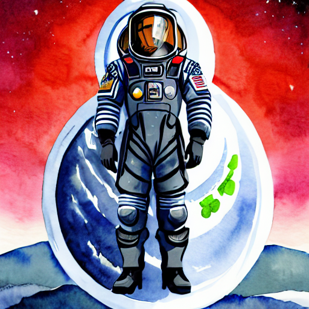
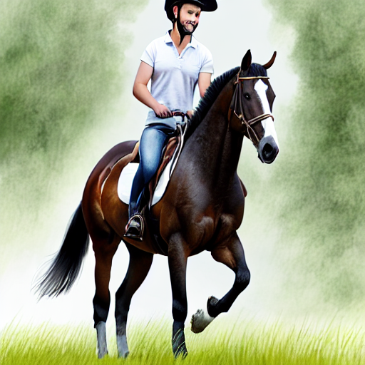
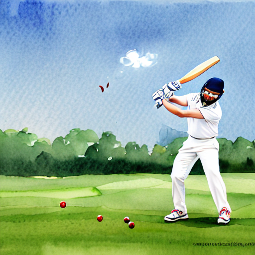

# Stable Diffusion LoRA Fine-Tuning for Watercolor Images

## Results
Here are the three generated watercolor-style images of `sks`:

### Scene 1: sks in a Futuristic Spacesuit on the Moon


### Scene 2: sks Riding a Horse in a Lush Meadow


### Scene 3: sks Playing Cricket on a Green Field


**Note**: If the images don’t display, ensure the paths are correct after uploading the repository to GitHub.

## Overview
This project fine-tunes a Stable Diffusion model using LoRA (Low-Rank Adaptation) to generate watercolor-style portraits of a person (`sks`). It includes two main scripts:
- `train_lora.py`: Fine-tunes the Stable Diffusion model on a small dataset of 4 images.
- `generate_images.py`: Uses the trained LoRA weights to generate new images based on creative prompts.

The dataset consists of 4 images of `sks`, and the model was trained for 1000 steps with a LoRA rank of 16. The generated images above depict `sks` in various scenarios, such as a futuristic spacesuit on the moon, riding a horse in a meadow, and playing cricket on a field, all in a watercolor style.

## Installation
1. Clone this repository:
   ```bash
   git clone https://github.com/yourusername/StableDiffusion-LoRA-FineTune-Watercolor.git
   cd StableDiffusion-LoRA-FineTune-Watercolor
   ```
2. Install the required dependencies:
   ```bash
   pip install torch torchvision diffusers==0.20.0 peft==0.4.0 accelerate pandas pillow
   ```
   - **Note**: This project uses `diffusers==0.20.0` and `peft==0.4.0`. Ensure compatibility with these versions.
3. Ensure you have a CUDA-enabled GPU if running on a local machine, or use Google Colab with a GPU runtime.

## Usage
### 1. Prepare the Dataset
- Place your images in the `data/face_images/` directory.
- Create a `data/metadata.csv` file with the following format:
  ```
  file_name,text
  image1.jpg,A portrait of sks, front view, neutral background
  image2.jpg,A portrait of sks, 3/4 view, natural lighting
  image3.jpg,A portrait of sks, side profile, indoor lighting
  image4.jpg,A portrait of sks, smiling, outdoor lighting
  ```

### 2. Train the Model
Run the training script to fine-tune Stable Diffusion with LoRA:
```bash
python scripts/train_lora.py > training_log.txt
```
- **Output**: LoRA weights will be saved in `output/lora_weights/` as `adapter_model.bin` and `adapter_model.safetensors`.
- **Training Details**: The script trains for 1000 steps with a LoRA rank of 16, achieving a final loss of around 0.045.

### 3. Generate Images
Use the trained LoRA weights to generate new images:
```bash
python scripts/generate_images.py
```
- **Output**: Generated images will be saved in `output/generated_images/` as `scene_1.png`, `scene_2.png`, and `scene_3.png`.
- **Prompts Used**:
  - "A watercolor painting of sks in a futuristic spacesuit, standing on a moon landscape, vibrant colors, detailed textures, high resolution, sharp details"
  - "A watercolor painting of sks riding a horse in a lush meadow, dynamic pose, soft pastel tones, high resolution, sharp details"
  - "A watercolor painting of sks playing cricket on a green field, action pose, bright and vivid colors, high resolution, sharp details"

## Challenges and Solutions
- **Challenge**: LoRA weights failed to load due to a naming mismatch (`adapter_model.bin` vs. `pytorch_lora_weights.bin`).
  - **Solution**: Wrapped the UNet with `PeftModel` in `generate_images.py` to load the weights correctly.
- **Challenge**: Generated images lacked clarity.
  - **Solution**: Increased training steps to 1000, LoRA rank to 16, inference steps to 75, and added "high resolution, sharp details" to prompts.

## Project Structure
```
StableDiffusion-LoRA-FineTune-Watercolor/
├── scripts/
│   ├── train_lora.py
│   └── generate_images.py
├── output/
│   ├── generated_images/
│   │   ├── scene_1.png
│   │   ├── scene_2.png
│   │   └── scene_3.png
│   └── lora_weights/
│       ├── adapter_config.json
│       ├── adapter_model.bin
│       ├── adapter_model.safetensors
│       └── README.md
├── data/
│   ├── face_images/
│   └── metadata.csv
└── README.md
```

## License
This project is licensed under the MIT License - see the [LICENSE](LICENSE) file for details.

---

**Note**: Replace `yourusername` in the `git clone` URL with your actual GitHub username when uploading the repository.